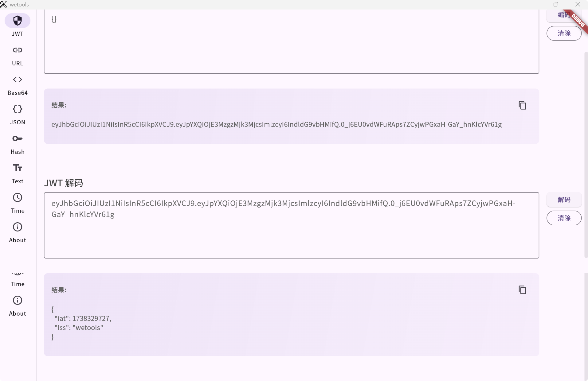
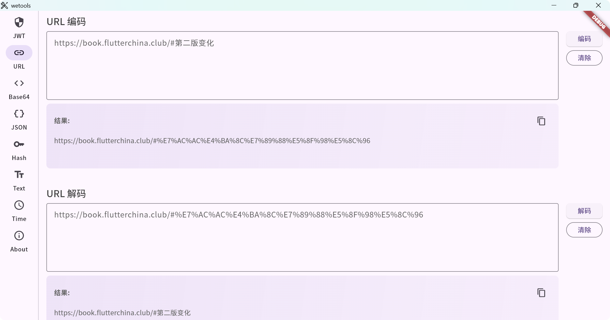
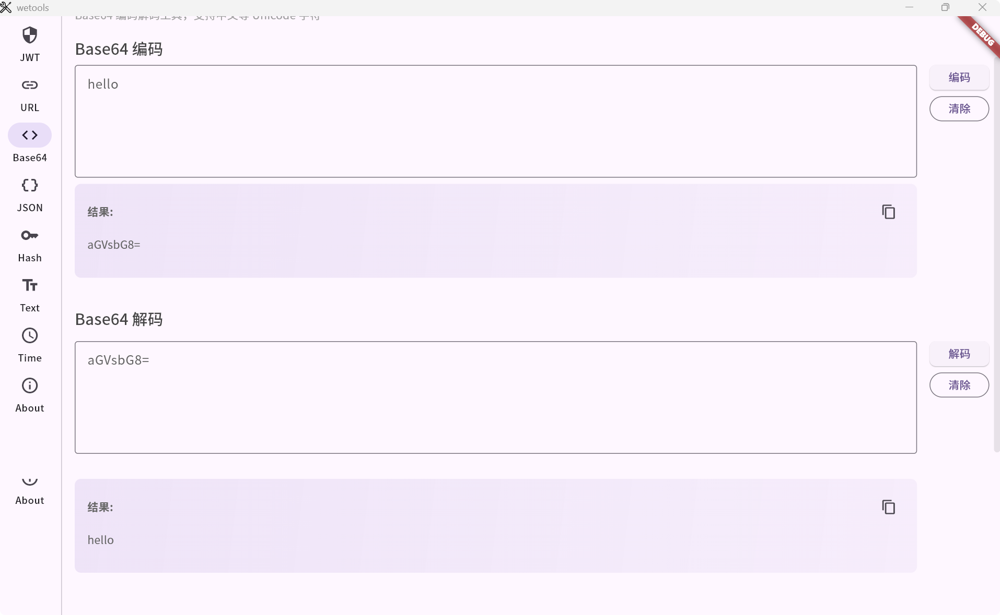
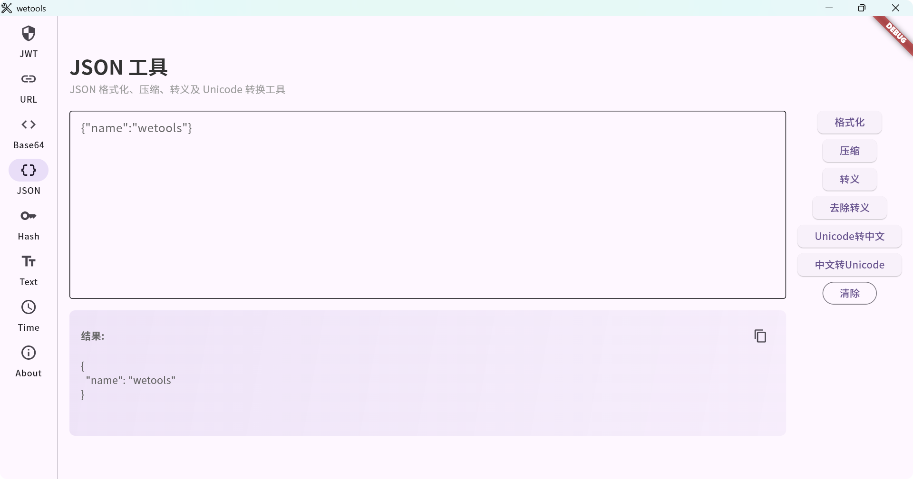
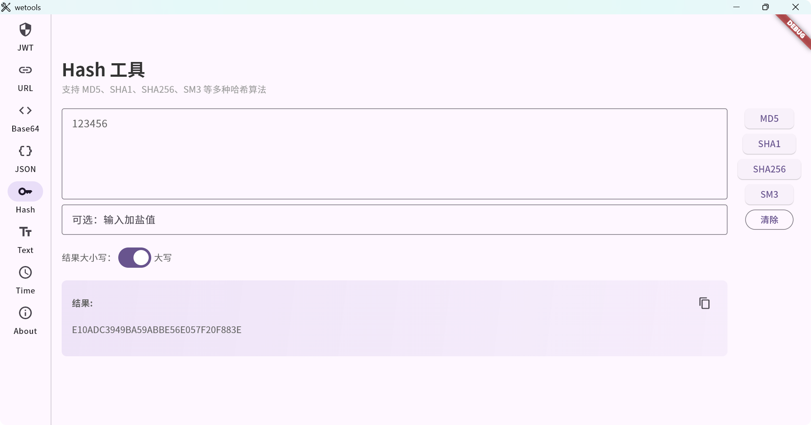
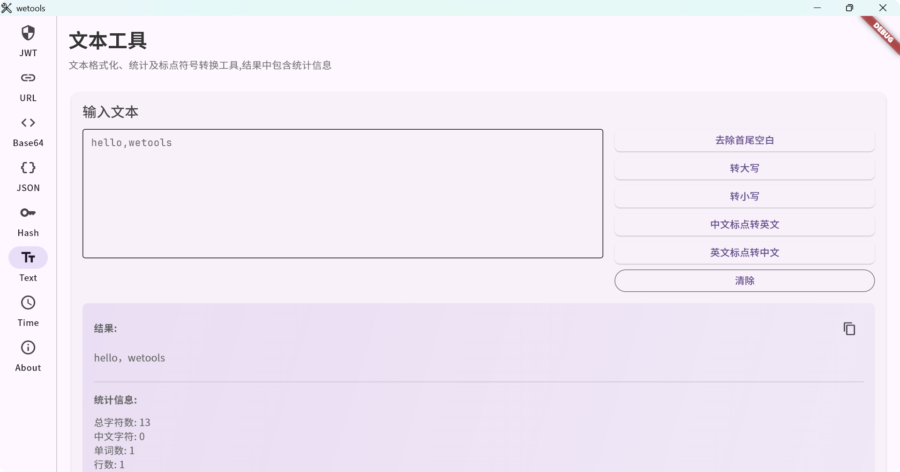
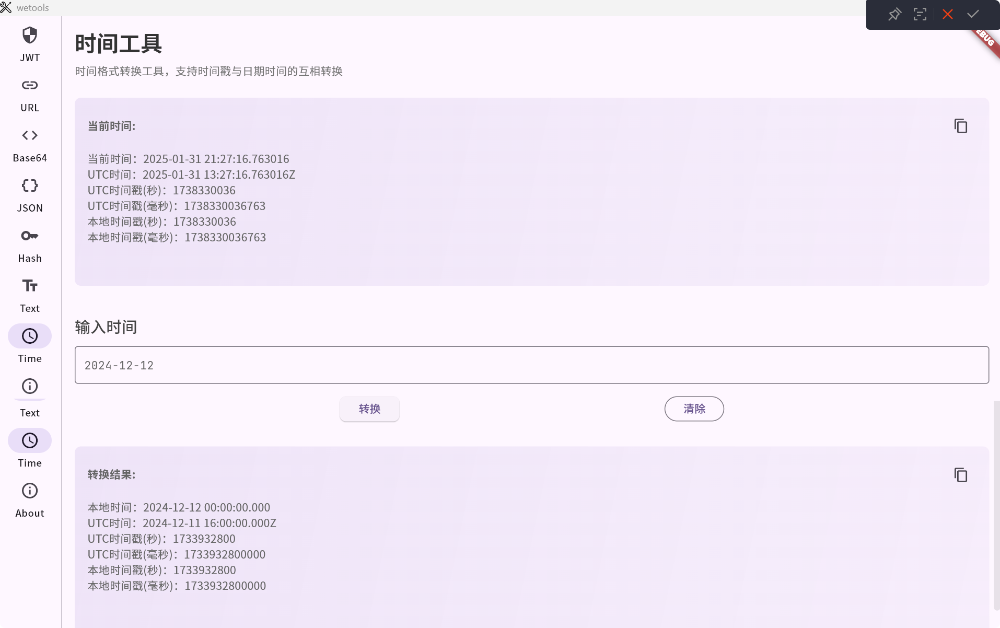

# WeTools - 开发者工具箱

一个使用 Flutter 开发的轻量级开发者工具箱，提供常用的编码解码、格式化、加密等功能。

## 最近更新

- 增加系统代理功能 - 2025-02-13
- 优化页面布局,颜色统一,页面元素支持选中复制 - 2025-02-13
- 优化页面,增加检测更新功能,增加窗口菜单页面 - 2025-02-12
- 新增邮件发送功能 - 2025-02-12
- 新增 DeepLx 翻译服务 - 2025-02-11
- 新增 IP 工具，支持获取国内公网IP和国外公网IP - 2025-02-10
- 统一界面配色,支持跟随系统主题 - 2025-02-10
- 新增 TCP 工具，支持 TCP 连接和发送命令 - 2025-02-09
- 时间工具增加时间选择器 - 2025-02-09
- 增加异常日志记录, 方便排查问题
- 部分页面结果增加保存文件功能
- 新增 HTTP 工具，支持 GET 和 POST 请求, 支持响应体保存
- 新增系统信息页面，展示系统信息和网络信息
- 优化内存占用及打包体积
- 增加翻译页面及功能
- 新增 UUID,随机字符 生成功能
- 新增文本转二维码生成功能
- base64 工具新增图片转码功能
- 新增 About 页面，展示项目信息和作者联系方式
- 优化所有输入框，支持多行输入和文本选择
- 修复 URL Launcher 在 Windows 平台的兼容性问题
- 统一界面风格，采用 Material Design 3
- 完善多平台支持（Windows/macOS/Linux/Web）

## 功能特性(持续更新中,请以实际为准)

- **JWT 工具**
  - JWT Token 编码/解码
  - 支持自定义密钥
  - 实时预览结果

- **URL 工具**
  - URL 编码/解码
  - 支持中文字符
  - 复制结果功能

- **Base64 工具**
  - 文本编码/解码
  - 支持 Unicode 字符
  - 错误提示功能

- **JSON 工具**
  - JSON 格式化
  - JSON 压缩
  - Unicode 转中文
  - 支持语法校验

- **Hash 工具**
  - MD5 计算
  - SHA1 计算
  - SHA256 计算
  - SM3 计算
  - 支持加盐处理
  - 支持大小写切换

- **文本工具**
  - 去除首尾空白
  - 大小写转换
  - 中英文标点转换
  - 字符统计（包含 UTF-8/GBK 编码长度）

## 开始使用
从 release 中下载对应平台的压缩包, 解压后即可运行.

### 环境要求

- Flutter 3.6.0 或更高版本
- Dart 3.0.0 或更高版本

### 安装
在 release 中下载对应平台的压缩包, 解压后即可运行.

注意: macos 如果打开提示恶意软件,是由于没有签名导致. 最低支持 macos 10.14.6 版本.

 1.右键点击应用 打开 

 2.在系统偏好设置 ->安全性与隐私 中允许打开

## 平台支持

- ✅ Windows
  - 支持 URL Launcher
  - 原生窗口支持
- ✅ macOS
  - 支持应用分类
  - URL Scheme 支持
- ✅ Linux
  - 基础功能支持
- ✅ Web
  - 响应式布局
  - CDN 资源支持

## 技术栈

- Flutter 3.6.0
- Dart 3.0.0
- Material Design 3
- Flutter Web

## macOS 使用说明

由于应用未经过 Apple 签名，首次运行时可能会提示"无法打开"，解决方法：

1. 在 Finder 中找到应用，右键点击 -> 打开
2. 在系统偏好设置 -> 安全性与隐私 中允许打开
3. 或使用终端命令：`xattr -cr /Applications/wetools.app`

